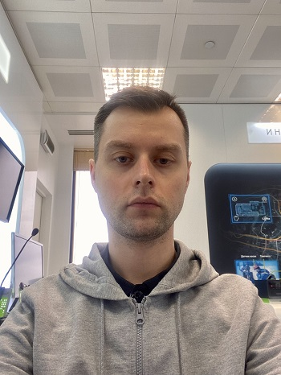

# Роман Подгорный

[Мои контакты и портфолио](https://taplink.cc/ripodgor)

## Тестировщик ПО     

### Обо мне
  
Я начинающий тестировщик ПО, изучаю курс тестировщика в Нетологии. Имею опыт работы в поддержке продаж и внедрении цифровых решений для бизнеса в Мегафон и Ростелеком.  Хочу получить профессию в ИТ и стать частью команды разработки ИТ-продуктов. 
По прошлым местам работы часто приходилось взаимодействовать с клиентами в части сбора обратной связи о внедренном продукте и багах, которые появлялись в процессе эксплуатации.
Есть практический опыт заведения баг-репортов и создания новых ИТ-проектов в Jira. 
Помимо профессиональных навыков, у меня хорошо развиты гибкие навыки. Умею ладить с клиентами, коллегами и начальниками. Я быстро выполняю поставленные задачи и работаю в высоком темпе. Я усидчивый и внимательный к деталям. Могу быстро разобраться в технических особенностях любого продукта.

  
